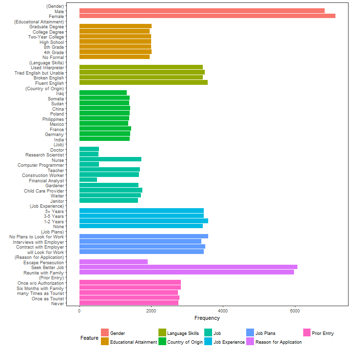

# Simple Conjoint Analyses and Visualization

**cregg** is a package for analyzing and visualizing the results of conjoint ("cj") factorial experiments. It provides functionality that is useful for analyzing and otherwise examining conjoint experimental data:

 - Estimation of average marginal component effects (AMCEs) for fully randomized conjoint designs and munging of AMCE estimates into tidy data frames, via `amce()`
 - Calculation of marginal means (MMs) for conjoint designs and munging them into tidy data frames via `mm()`
 - Tabulation of display frequencies of feature attributes via `freqs()`
 - **ggplot2**-based visualizations of AMCEs and MMs, via `plot()` methods for all of the above

The package takes its name from the surname of a famous White House Press Secretary.

The main selling point of cregg is simplicity of implementation and - unlike the [cjoint](https://cran.r-project.org/package=cjoint) package - cregg tries to follow tidy data principles throughout. Thus the response from both `mm()` and `cj()` consists of tidy data frames that can easily be stacked with others (e.g., for computing AMCEs for subsets of respondents and then producing a facetted or grouped visualization). It also tries to take better advantage of data preprocessing steps by:

 - Using factor base levels rather than trying to set baseline levels atomically
 - Using "label" attributes on variables to provide pretty printing

Additionally all functions have arguments in data-formula order, making it simple to pipe into them via `%>%`.

Contributions and feedback are welcome on [GitHub](https://github.com/leeper/cregg/issues).

## Code Examples


The package includes an example conjoint dataset (borrowed and lightly modified from the [cjoint](https://cran.r-project.org/package=cjoint) package), which is used here and and in examples:


```r
library("cregg")
data("hainmueller")
```

The package provides straightforward calculation and visualization of descriptive marginal means (MMs). These represent the mean outcome across all appearances of a particular conjoint feature level, averaging across all other features. In forced choice conjoint designs, MMs by definition average 0.5 with values above 0.5 indicating features that increase profile favorability and values below 0.5 indicating features that decrease profile favorability. For continuous outcomes, AMMs can take any value in the full range of the outcome. Calculation of MMs entail no modelling assumptions are simply descriptive quantities of interest:


```r
# descriptive plotting
f1 <- ChosenImmigrant ~ Gender + Education + LanguageSkills + CountryOfOrigin + Job + JobExperience + JobPlans + ReasonForApplication + 
    PriorEntry
plot(mm(hainmueller, f1, id = ~CaseID), vline = 0.5)
```


cregg functions uses `attributes(feature)$label` to provide pretty printing of feature labels, so that varible names can be arbitrary. These can be overwritten using the `feature_labels` argument to override these settings. Feature levels are always deduced from the `levels()` of righthand-side variables in the model specification. All variables should be factors with levels in desired display order. Similarly, the plotted order of features is given by the order of terms in the RHS formula unless overridden by the order of variable names given in `feature_order`.

A more common analytic approach for conjoints is to estimate average marginal component effects (AMCEs) using some form of regression analysis. cregg uses `glm()` and `svyglm()` to perform estimation and [margins](https://cran.r-project.org/package=margins) to generate average marginal effect estimates. Designs can be specified with any interactions between conjoint features but only AMCEs are returned. (No functionality is provided at the moment for explict estimation of feature interaction effects.) Just like for `amm()`, the output of `cj()` (or its alias, `amce()`) is a tidy data frame:


```r
# estimation
f2 <- ChosenImmigrant ~ Gender + Education + LanguageSkills + CountryOfOrigin
amces <- cj(hainmueller, f2, id = ~CaseID)
str(amces)
```

```
Classes 'cj_amce' and 'data.frame':	23 obs. of  9 variables:
 $ outcome  : chr  "ChosenImmigrant" "ChosenImmigrant" "ChosenImmigrant" "ChosenImmigrant" ...
 $ feature  : Factor w/ 4 levels "Gender","Educational Attainment",..: 1 1 2 2 2 2 2 2 2 3 ...
 $ level    : Factor w/ 23 levels "Female","Male",..: 1 2 3 4 5 6 7 8 9 10 ...
 $ estimate : num  0 -0.0273 0 0.0323 0.0591 ...
 $ std.error: Named num  NA 0.00831 NA 0.01534 0.0154 ...
  ..- attr(*, "names")= chr  NA "Var_dydx_GenderMale" NA "Var_dydx_Education4th Grade" ...
 $ z        : num  NA -3.28 NA 2.11 3.84 ...
 $ p        : num  NA 0.001036 NA 0.035009 0.000125 ...
 $ lower    : num  NA -0.04355 NA 0.00227 0.02891 ...
 $ upper    : num  NA -0.011 NA 0.0624 0.0893 ...
```

This makes it very easy to modify, combine, print, etc. the resulting output. It also makes it easy to visualize using ggplot2. A convenience visualization function is provided:


```r
# plotting of AMCEs
plot(amces)
```


The package also provide a useful function for checking display frequencies of conjoint features (to ensure equal - or unequal - display frequency):


```r
# plotting of display frequencies
plot(freqs(hainmueller, f1, id = ~CaseID))
```



As can be clear in the above, constraints were imposed in the original study on the allowed combinations of `Job` and `Education` and also on combinations of `CountryOfOrigin` and `ReasonForApplication`:


```r
table(hainmueller$Job, hainmueller$Education)
```

```
                     
                      No Formal 4th Grade 8th Grade High School Two-Year College College Degree Graduate Degree
  Janitor                   290       270       299         240              182            190             162
  Waiter                    275       282       301         283              171            202             208
  Child Care Provider       288       324       286         315              200            172             171
  Gardener                  257       275       284         284              172            189             191
  Financial Analyst           0         0         0           0              171            154             162
  Construction Worker       281       283       250         289              181            183             191
  Teacher                   275       288       282         287              201            168             188
  Computer Programmer         0         0         0           0              169            196             177
  Nurse                     298       296       296         296              197            178             170
  Research Scientist          0         0         0           0              176            169             195
  Doctor                      0         0         0           0              185            162             203
```

```r
table(hainmueller$CountryOfOrigin, hainmueller$ReasonForApplication)
```

```
             
              Reunite with Family Seek Better Job Escape Persecution
  India                       695             706                  0
  Germany                     704             719                  0
  France                      704             738                  0
  Mexico                      690             674                  0
  Philippines                 710             682                  0
  Poland                      707             694                  0
  China                       438             485                494
  Sudan                       427             482                484
  Somalia                     465             463                475
  Iraq                        442             436                446
```

## Installation

[](https://cran.r-project.org/package=cregg)

[](https://travis-ci.org/leeper/cregg)
[](https://ci.appveyor.com/project/leeper/cregg)
[](https://codecov.io/github/leeper/cregg?branch=master)

This package is not yet on CRAN. To install the latest development version you can pull a potentially unstable version directly from GitHub:

```R
if (!require("ghit")) {
    install.packages("ghit")
}
ghit::install_github("leeper/cregg")
```
