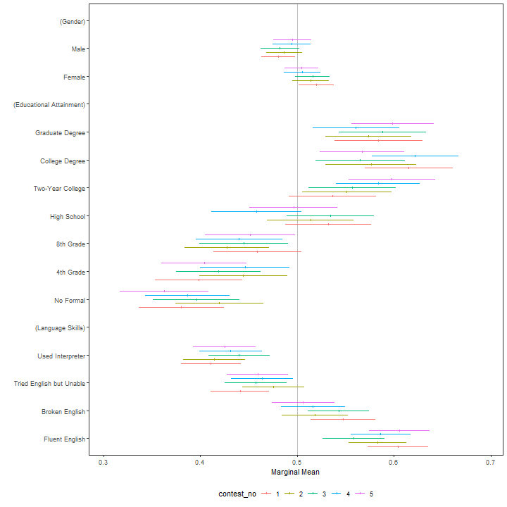

# Simple Conjoint Analyses and Visualization

**cregg** is a package for analyzing and visualizing the results of conjoint ("cj") factorial experiments using methods described by Hainmueller, Hopkins, and Yamamoto (2014). It provides functionality that is useful for analyzing and otherwise examining conjoint experimental data through a main function - `cj()` - that simply wraps around a number of analytic tools:

 - Estimation of average marginal component effects (AMCEs) for fully randomized conjoint designs (as well as designs involving an unlimited number of two-way constraints between features) and munging of AMCE estimates into tidy data frames, via `amce()`
 - Calculation of marginal means (MMs) for conjoint designs and munging them into tidy data frames via `mm()`
 - Tabulation of display frequencies of feature attributes via `freqs()` and cross-tabulation of feature restrictions using `props()`
 - Diagnostics to assess preference heterogeneity, including an omnibus statstical test (`cj_anova()`) and tidying of differences in MMs (`mm_diffs()`) and AMCEs (`amce_diffs()`) across subgroups
 - Diagnostics to choose feature reference categories, via `amce_by_reference()`
 - **ggplot2**-based visualizations of AMCEs and MMs, via `plot()` methods for all of the above

To demonstrate package functionality, the package includes two example datasets:

 - `taxes`, a full randomized choice task conjoint experiment conducted by Ballard-Rosa et al. (2016)
 - `immigration`, a partial factorial conjoint experiment with several restrictions between features conducted by Hainmueller, Hopkins, and Yamamoto (2014)

The design of cregg follows a few key princples:

 - Following tidy data principles throughout, so that all of the main functions produce consistently structured, metadata-rich data frames. Thus the response from any function is a tidy data frame that can easily be stacked with others (e.g., for computing AMCEs for subsets of respondents) and then producing ggplot2 visualizations. 
 - A formula-based interface that meshes well with the underlying [**survey**](https://cran.r-project.org/package=survey)-based effect estimation API.
 - A consistent interface for both unconstrained and two-way constrained designs that relies only on formula notation without any package-specific "design" specification. Conjoint designs involving two-way constraints between features are easily supported using simple formula notation: `Y ~ A + B + C` implies an unconstrained design, while `Y ~ A * B + C` implies a constraint between levels of features A and B. cregg figures out the constraints automatically without needing to further specify them explicitly.

cregg also provides some sugar:

 - Using "label" attributes on variables to provide pretty printing, with options to relabel features or plots on the fly
 - Using factor base levels rather than trying to set baseline levels atomically
 - A convenient API (via the `cj(..., by = ~ group)` idiom) for repeated, subgroup operations without the need for `lapply()` or `for` loops
 - All functions have arguments in data-formula order, making it simple to pipe into them via the magrittr pipe (`%>%`).

A detailed website showcasing package functionality is available at: https://thomasleeper.com/cregg/. Contributions and feedback are welcome on [GitHub](https://github.com/leeper/cregg/issues).

The package, whose primary point of contact is `cj()`, takes its name from the surname of a famous White House Press Secretary.

## Basic Code Examples


The package includes an example conjoint dataset (borrowed and lightly modified from the [cjoint](https://cran.r-project.org/package=cjoint) package), which is used here and and in examples:


```r
library("cregg")
data("immigration")
data("taxes")
```

The package provides straightforward calculation and visualization of descriptive marginal means (MMs). These represent the mean outcome across all appearances of a particular conjoint feature level, averaging across all other features. In forced choice conjoint designs, MMs by definition average 0.5 with values above 0.5 indicating features that increase profile favorability and values below 0.5 indicating features that decrease profile favorability. For continuous outcomes, MMs can take any value in the full range of the outcome. Calculation of MMs entail no modelling assumptions are simply descriptive quantities of interest:


```r
# descriptive plotting
f1 <- ChosenImmigrant ~ Gender + Education + LanguageSkills + CountryOfOrigin + Job + JobExperience + JobPlans + ReasonForApplication + 
    PriorEntry
plot(mm(immigration, f1, id = ~CaseID), vline = 0.5)
```


cregg functions uses `attr(data$feature, "label")` to provide pretty printing of feature labels, so that variable names can be arbitrary. These can be overwritten using the `feature_labels` argument to override these settings. Feature levels are always deduced from the `levels()` of righthand-side variables in the model specification. All variables should be factors with levels in desired display order. Similarly, the plotted order of features is given by the order of terms in the RHS formula unless overridden by the order of variable names given in `feature_order`.

A more common analytic approach for conjoints is to estimate average marginal component effects (AMCEs) using some form of regression analysis. cregg uses `glm()` and `svyglm()` to perform estimation and [margins](https://cran.r-project.org/package=margins) to generate average marginal effect estimates. Designs can be specified with any interactions between conjoint features but only AMCEs are returned. (No functionality is provided at the moment for explict estimation of feature interaction effects.) Just like for `mm()`, the output of `cj()` (or its alias, `amce()`) is a tidy data frame:


```r
# estimation
amces <- cj(taxes, chose_plan ~ taxrate1 + taxrate2 + taxrate3 + taxrate4 + taxrate5 + taxrate6 + taxrev, id = ~ID)
head(amces[c("feature", "level", "estimate", "std.error")], 20L)
```

```
                          feature         level      estimate   std.error
1           Tax rate for <$10,000      <10k: 0%  0.0000000000          NA
2           Tax rate for <$10,000      <10k: 5% -0.0139987267 0.008367718
3           Tax rate for <$10,000     <10k: 15% -0.0897702241 0.009883554
4           Tax rate for <$10,000     <10k: 25% -0.2215066470 0.012497932
5    Tax rate for $10,000-$35,000    10-35k: 5%  0.0000000000          NA
6    Tax rate for $10,000-$35,000   10-35k: 15% -0.0161677383 0.010015769
7    Tax rate for $10,000-$35,000   10-35k: 25% -0.0849079259 0.015824370
8    Tax rate for $10,000-$35,000   10-35k: 35% -0.1868125806 0.021074682
9    Tax rate for $25,000-$85,000    35-85k: 5%  0.0000000000          NA
10   Tax rate for $25,000-$85,000   35-85k: 15%  0.0005356495 0.008242105
11   Tax rate for $25,000-$85,000   35-85k: 25% -0.0533364485 0.009713809
12   Tax rate for $25,000-$85,000   35-85k: 35% -0.1083416179 0.011917151
13  Tax rate for $85,000-$175,000   85-175k: 5%  0.0000000000          NA
14  Tax rate for $85,000-$175,000  85-175k: 15%  0.0194226595 0.007719126
15  Tax rate for $85,000-$175,000  85-175k: 25%  0.0108897506 0.008078966
16  Tax rate for $85,000-$175,000  85-175k: 35% -0.0015463277 0.008431674
17 Tax rate for $175,000-$375,000  175-375k: 5%  0.0000000000          NA
18 Tax rate for $175,000-$375,000 175-375k: 15%  0.0384042184 0.008581007
19 Tax rate for $175,000-$375,000 175-375k: 25%  0.0504838117 0.008867028
20 Tax rate for $175,000-$375,000 175-375k: 35%  0.0716090284 0.009162901
```

This makes it very easy to modify, combine, print, etc. the resulting output. It also makes it easy to visualize using ggplot2. A convenience visualization function is provided:


```r
# plotting of AMCEs
plot(amces)
```


To provide simple subgroup analyses, the `cj()` function provides a `by` argument to iterate over subsets of `data` and calculate AMCEs or MMs on each subgroup. For example, we may want to ensure that there are no substantial variations in preferences within-respondents across multiple conjoint decision tasks:


```r
mm_by <- cj(immigration, ChosenImmigrant ~ Gender + Education + LanguageSkills, id = ~CaseID, estimate = "mm", by = ~contest_no)
plot(mm_by, group = "contest_no", vline = 0.5)
```



A more formal test of these differences is provided by a nested model comparison test:


```r
cj_anova(immigration, ChosenImmigrant ~ Gender + Education + LanguageSkills, by = ~contest_no)
```

```
Analysis of Deviance Table

Model 1: ChosenImmigrant ~ Gender + Education + LanguageSkills
Model 2: ChosenImmigrant ~ Gender + Education + LanguageSkills + contest_no + 
    Gender:contest_no + Education:contest_no + LanguageSkills:contest_no
  Resid. Df Resid. Dev Df Deviance      F Pr(>F)
1     13949     3353.0                          
2     13938     3349.6 11   3.3873 1.2814 0.2279
```

which provides a test of whether any of the interactions between the `by` variable and feature levels differ from zero.

Again, a detailed website showcasing package functionality is available at: https://thomasleeper.com/cregg/ and the content thereof is installed as a vignette. The package documentation provides further examples.

## Installation

[](https://cran.r-project.org/package=cregg)

[](https://travis-ci.org/leeper/cregg)
[](https://codecov.io/github/leeper/cregg?branch=master)

This package is not yet on CRAN. To install the latest development version you can pull a potentially unstable version directly from GitHub:

```R
if (!require("remotes")) {
    install.packages("remotes")
}
remotes::install_github("leeper/cregg")
```
